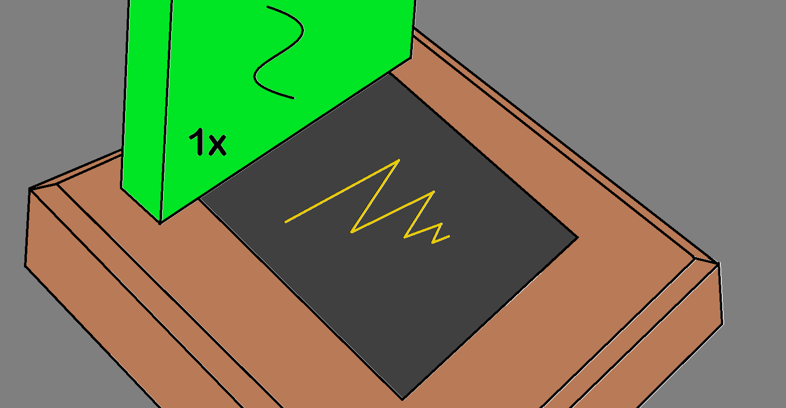
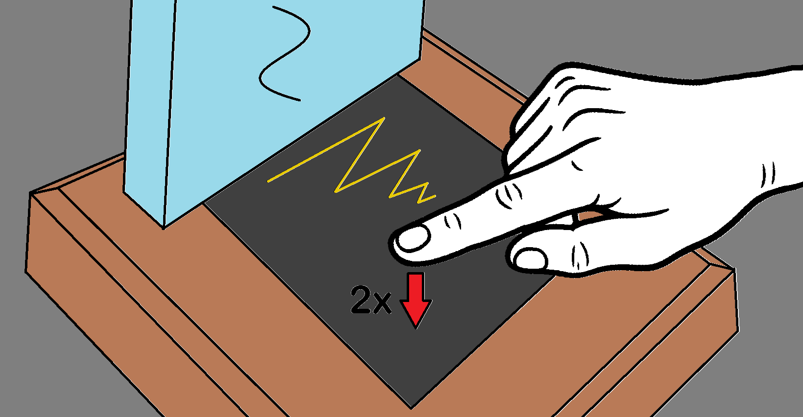

# Nachtlicht / Night light

---

### Sprache/Language:
- [Deutsch](#deutsch)
- [English](#english)

---

## Deutsch

### 0. Inhaltsverzeichnis
- [1. Inbetriebnahme](#1-inbetriebnahme)
- [2. Bedienung](#2-bedienung)
- [3. Hinweise](#3-hinweise)
- [4. Sicherheit](#4-sicherheit)
- [5. Technische Daten](#5-technische-daten)

## 1. Inbetriebnahme
1. Batterie einlegen
*Bitte verwenden Sie ausschließlich Batterien mit der Größe AA und einer Spannung von 1,5V.*

2. LEDs leuchten grün, der Touch Sensor kalibriert sich.
*Während die LEDs grün leuchten, Touch Oberfläche nicht berühren*

3. LEDs gehen wieder aus. Das Nachtlicht ist betriebsbereit.

## 2. Bedienung
- Einmal kurz auf die goldene Oberfläche tippen: Licht geht AN/AUS (Tippen <1s)

- Lange auf die goldene Oberfläche tippen: Lichtfarbe verändert sich... (Tippen >1s)

- Zwei mal kurz auf die goldene Oberfläche tippen: HELL/DUNKEL Einstellung (Tippen 2x in 1s)

- Fünf mal kurz auf die goldene Oberfläche tippen: Party Modus...

## 3. Hinweise
- Licht blinkt während dem Betrieb zwei mal rot: Batterie schwach (Blink Intervall 60s)

- Beim einlegen "neuer" Batterien ins Batteriefach blinken die LEDs fünf mal rot: Batterie schwach

- Beim einlegen "neuer" Batterien ins Batteriefach bleiben die LEDs aus: Batterien tot

- Nach 3 Stunden ohne Touch Berührung geht das Licht von alleine aus (Party Modus timeout: 6h)

## 4. Sicherheit
- Batterien nicht falsch herum einlegen.
- Nur AA-Batterien mit 1.5V verwenden.
- LED Licht nur in trockener und warmer Umgebung betreiben.
- Nicht das Gehäuse öffnen.
- Keine metallischen Gegenstände in Öffnungen stecken.
- Nicht herumwerfen, verbrennen, essen, ...
- Einfach nichts Dummes damit machen...

## 5. Technische Daten

| Parameter            | Wert                 |
| -------------------- | -------------------- |
| UMax      | 5,5V                 |
| ULow      | 3,2V                 |
| UShutdown | 3,0V                 |
| IRun-max  | 100mA                |
| IStandby  | 100µA                |
| Betriebstemperatur   | 0...40°C             |
| Abmaße               | 150×150×128mm        |
| Gewicht              | 675g (mit Batterien) |

---

## English
tbd

---
© 2025 USPLab – Daniel Ullrich  
Support: usplab.design@gmail.com

v0.2